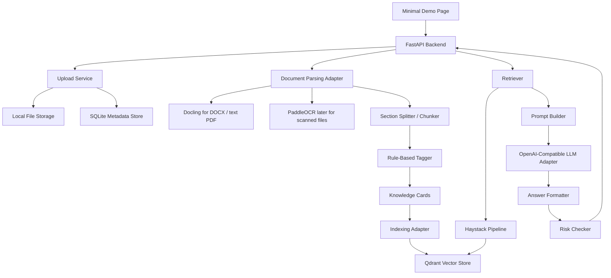
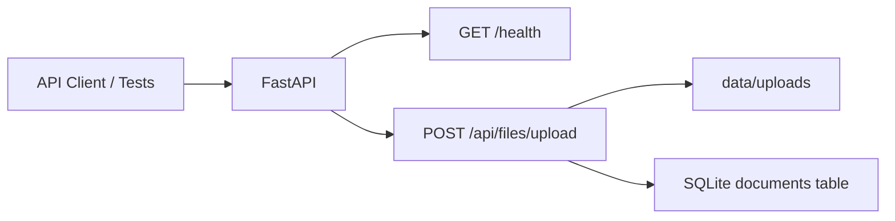

# Target Architecture

## Architecture Principle

Build a thin bidding-domain service around proven RAG/document components.

The system should not become a generic RAG platform. It should expose the smallest API and demo flow needed to validate the PRD.

## High-Level Shape



## Phase 1 Architecture

Phase 1 implements only the foundation:



Phase 1 does not call Docling, PaddleOCR, Haystack, Qdrant, or any LLM.

## Backend Module Plan

```text
backend/
├── app/
│   ├── main.py
│   ├── config.py
│   ├── api/
│   │   ├── health.py
│   │   └── files.py
│   ├── schemas/
│   │   └── document.py
│   ├── storage/
│   │   ├── database.py
│   │   └── file_storage.py
│   ├── services/
│   │   ├── document_parser/
│   │   ├── section_splitter/
│   │   ├── tagger/
│   │   ├── knowledge_card/
│   │   ├── retriever/
│   │   ├── llm/
│   │   └── risk_checker/
│   └── adapters/
│       ├── docling_parser.py
│       ├── paddleocr_parser.py
│       ├── qdrant_store.py
│       └── llm_gateway.py
└── tests/
```

Phase 1 should create only the parts it needs. Empty future service modules should not be added until their phase starts.

## Data Flow By Phase

### Phase 1

1. Upload file.
2. Save original file under `data/uploads`.
3. Insert document metadata into SQLite.
4. Return document id and `parse_status = pending`.

### Phase 2

1. Parse document through Docling adapter.
2. Produce normalized sections/chunks.
3. Apply deterministic tags.
4. Store section/card metadata.

### Phase 3

1. Embed chunks.
2. Write vectors and payload metadata to Qdrant.
3. Retrieve by tag and semantic query through Haystack/Qdrant adapter.

### Phase 4

1. Build prompt from tender requirements and retrieved cards.
2. Generate candidate content through an OpenAI-compatible adapter.
3. Return generated content with citations, risks, and `need_human_review = true`.

## Key Interfaces

### Document Metadata

See `docs/ai/12-phase1-api-persistence.md`.

### Chunk Payload

Future retrieval payload should include:

- `doc_id`
- `doc_title`
- `page_no`
- `section_path`
- `chunk_type`
- `tags`
- `bbox`
- `table_html`
- `ocr_confidence`
- `source_uri`
- `ingest_version`

### Generation Result

Every generated response must include:

- `target_tag`
- `generated_content`
- `citations`
- `risks`
- `need_human_review = true`

## Architecture Decisions

1. Use external platforms as references, not as the mainline codebase.
2. Keep all heavy capabilities behind adapters.
3. Keep Phase 1 independent of RAG dependencies.
4. Prefer local SQLite and local file storage until the demo proves the vertical slice.
5. Add Qdrant/Haystack only when retrieval work starts.
6. Add Docling only when parsing work starts.
7. Add PaddleOCR only when scanned documents become a required validation path.
