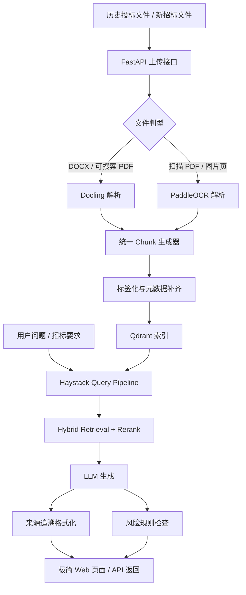

# 投标智能知识库 Demo GitHub 对标与二开方案

## 执行摘要

这次选型要分成两个问题来回答：**谁最像你们要给甲方看的成品**，以及**谁最适合按你们的默认值在两周内 fork 并二开**。结合你给定的约束——Python + FastAPI、极简前端、允许外部模型/API、OCR 优先本地开源、第一阶段只处理 2–3 份样例、优先 MIT/Apache、Docker/Ubuntu 本地开发——结论是：**RAGFlow 最像“投标智能知识库 Demo”的成品对标样板；Haystack 最适合作为真正落地的主项目底座**。RAGFlow 的强项是“深文档理解 + 引用追溯 + 现成 RAG 工作流”，但官方要求的本地资源更高，默认栈也更重；Haystack 则是 Python 原生、检索/编排模块化、Qdrant/多家模型提供方集成成熟，更适合用 FastAPI 包一层极简 API 和页面快速交付。citeturn13search2turn13search12turn19search2turn6view0turn20search3turn20search4

如果把“对标”和“实做”拆开，最稳妥的执行方案是：**主底座选 Haystack，文档解析选 Docling，OCR 选 PaddleOCR，向量检索选 Qdrant，前端不直接套完整平台，而是在 FastAPI 里做很薄的一层上传/检索/生成页面**。这组组合的优点是许可证干净、组件边界清晰、Codex 容易读源码和改补丁、未来也能逐步替换成更强的解析器或更大的模型而不推翻整体。Docling 官方已经给出与 Haystack 和 Qdrant 的联动示例；Qdrant 本地可直接用 Docker 启动；PaddleOCR 则已经把 PDF/图片转结构化 JSON/Markdown、坐标信息和多语言 OCR 做成成熟能力。citeturn15search5turn15search1turn14view0turn6view5

不建议第一阶段直接重度 fork Dify 或 MinerU。Dify 虽然功能很全，且支持知识库检索、引用与外部知识 API，但它采用 **Dify Open Source License**，是基于 Apache 2.0 的自定义许可证；MinerU 也刚从 AGPLv3 迁到 **MinerU Open Source License**，同样是基于 Apache 2.0 的自定义许可证。对“可商用演示 + 后续可继续本地二开”的项目来说，这两类自定义许可证都应进入法务复核清单，而不是默认当作“纯 Apache 项目”直接开抄。citeturn1view0turn17search1turn17search2turn6view7turn4search0

本报告的核心建议可以压缩成一句话：**功能对标看 RAGFlow，工程落地 fork Haystack，组件补齐用 Docling + PaddleOCR + Qdrant，FastAPI 自己包一层极简演示壳。** 这样既能在演示上贴近“上传历史文件 → 解析/切分 → 入库标签化 → RAG 检索 → LLM 生成 → 来源追溯 → 风险提示”的链路，也能把两周内真正要写的代码控制在一个小而清晰的边界里。citeturn13search2turn20search2turn15search2turn6view5turn14view0

## 需求上下文与边界

从交付形态看，这不是“做一个通用 AI 平台”，而是做一个**投标智能知识库 Demo**：把少量历史投标文件导入，尽可能保留章节、表格、页码、表头、附件等文档结构；对新的招标文件或提问做检索增强生成；回答必须能回到来源片段；并对明显的风险项给出提示。按你给定的默认值，第一阶段只需要 2–3 份样例，目标是把主链路跑通，而不是做大规模批量治理、企业级权限管理或完整标书自动生成。这个边界决定了我们要优先选择**组件化、可裁剪、可快速出 Demo 的 repo**，而不是“带完整后台、工作流画布、团队协作、插件市场”的大而全平台。citeturn13search2turn17search3turn17search9

明确不做项也很重要。第一阶段不建议把范围扩到：完整投标编制系统、多租户权限体系、工作流编排台、复杂审批流、全文精细字段抽取训练、模型微调平台、全量样本治理、复杂报表统计。这些能力 Dify、RAGFlow、AnythingLLM 等平台中有不少已经做成了完整产品形态，但它们恰恰会把你们拖进“抄平台”而不是“做交付链路”的陷阱。Dify 的文档明确支持知识检索节点、知识库 API 和外部知识服务接入；RAGFlow 的文档则直接把自己定位为带 Agent 能力的 RAG 引擎；AnythingLLM 也提供完整 Docker 化应用与文档聊天界面。对你们现在的阶段，这些都是“可参考的能力清单”，不是“第一阶段必须照抄的系统边界”。citeturn17search2turn17search3turn17search4turn13search2turn19search7

建议把 Demo 核心链路固定成下面这个最短闭环，并且围绕这个闭环做一切代码取舍：


这条链路在开源项目中的映射是很清晰的：Docling / PaddleOCR / MinerU / Unstructured 负责“解析”；Qdrant 负责“存”；Haystack / RAGFlow / Dify 负责“检索与生成编排”；FastAPI 负责“对外 API 和页面”；引用追溯则来自解析阶段保留下来的页码、章节路径、坐标和源文档元数据。官方资料也都在强调这些点：Docling突出统一文档表示和高级 PDF 理解；PaddleOCR突出结构化 JSON/Markdown 与坐标信息；Qdrant 支持本地向量检索；Haystack 支持检索、生成、路由、追踪和多模型接入。citeturn15search10turn15search2turn6view5turn14view0turn6view0

## GitHub 对标项目池与评分

下表中的 stars / forks / 最近更新日期，均取自 **2026-06-27** 访问到的 GitHub 仓库页面或官方文档中的 latest release / visible update 信息。分数是**按你们的默认值**打的主观工程分：更看重 Python/FastAPI 适配、二开速度、许可证清晰度，以及两周内出 Demo 的可控性，而不是单纯看功能堆叠。citeturn2view0turn2view3turn2view5turn1view2turn12view0turn12view1turn7view0turn7view1turn7view3turn8view0turn10view0turn7view6

| 类别 | 项目 | 功能简介 | 主要语言 | 许可证 | 部署复杂度 | 来源追溯 | 易二开 | 适合本地 Codex | 最近更新日期 | stars / forks | 业务匹配 | 二开速度 | 文档解析 | RAG 引用 | 许可证风险 | 总体推荐分 |
|---|---|---|---|---|---|---|---|---|---|---:|---:|---:|---:|---:|---:|---:|
| RAG 平台 | RAGFlow citeturn1view1turn13search2turn13search12turn16view1turn19search2 | 深文档理解、RAG、Agent、引用追溯一体化，最像“成品 Demo” | Go / Python / TypeScript | Apache-2.0 | 高 | 是 | 中 | 中 | 2026-06-17 | 83.7k / 9.7k | 5 | 2 | 5 | 5 | 5 | 4.2 |
| RAG 平台 | Dify citeturn1view0turn17search1turn17search2turn17search3turn16view0turn19search1turn19search4 | 工作流、知识库、外部知识 API、引用与归因支持完整 | TypeScript / Python | Dify Open Source License | 中高 | 是 | 中 | 中 | 2026-06-25 | 147k / 23.1k | 4 | 2 | 3 | 4 | 2 | 3.4 |
| RAG 编排 | Haystack citeturn6view0turn12view0turn12view2turn20search2turn20search3turn20search4turn20search5 | Python 原生检索/生成/路由框架，适合定制 FastAPI 服务 | Python | Apache-2.0 | 低中 | 部分 | 是 | 是 | 2026-06-18 | 25.7k / 2.9k | 4 | 5 | 3 | 3 | 5 | 4.4 |
| RAG 平台 | AnythingLLM citeturn1view3turn2view5turn2view6turn2view7turn13search19turn19search7turn16view2 | 文档聊天、Workspace、/proof 引用查看、本地优先 | JavaScript | MIT | 中 | 是 | 中 | 低 | 2026-06-25 | 62.2k / 6.8k | 3 | 2 | 2 | 4 | 5 | 3.2 |
| 中文 RAG | Langchain-Chatchat citeturn1view2turn18search0turn18search9turn18search3 | 中文本地知识库问答、FastAPI + Streamlit、File RAG | Python | Apache-2.0 | 中 | 部分 | 中高 | 中高 | 2024-07-12 | 38.2k / 6.2k | 4 | 4 | 2 | 3 | 5 | 3.9 |
| 后端模板 | full-stack-fastapi-template citeturn6view3turn7view7turn12view1 | 现代 FastAPI + React + Docker 模板，适合参考工程组织方式 | Python / TypeScript | MIT | 中 | 否 | 是 | 是 | 2026-01-23 | 43.9k / 8.7k | 2 | 4 | 1 | 1 | 5 | 3.1 |

平台层的结论很明确：**如果只问“GitHub 上谁最像你们要展示的业务成品”，答案是 RAGFlow；如果问“谁最适合按默认值二开成自己的 Demo backend”，答案是 Haystack。** RAGFlow 官方明确把“深文档理解 + 引用支撑的问答”作为核心卖点，甚至在后续版本中直接提到会调用 MinerU 和 Docling 这类解析模型；但它的本地前提也更高，官方 quickstart 给出的建议是 x86 CPU 至少 4 核、16GB 内存、50GB 磁盘。相比之下，Haystack 更像一套可控的零件库，官方强调它是 Python 的生产级 LLM 应用编排框架，支持本地和云端多种模型、明确的检索/路由/生成组件，以及通过 HTTP 暴露 pipeline 的方式。citeturn13search2turn13search21turn19search2turn6view0turn20search2turn20search12

Dify 的参考价值不在“直接 fork”，而在“功能对照表”和“外部知识 API 思路”。官方文档写得很清楚：知识检索节点可以搜索知识库并把结果作为上下文喂给下游 LLM；在应用层面可以开启 Citation and Attribution；还可以通过 External Knowledge API 直接接入你们自己的检索服务，只让 Dify 充当 UI 和工作流外壳。也就是说，如果第二阶段甲方突然想要一个低代码可视化工作流台，Dify 是强备选；但第一阶段如果你们只需要极简前端，它会引入比收益更高的平台复杂度和许可证审查成本。citeturn17search1turn17search2turn17search3turn17search4

组件层则更适合做“拼装式选择”。下面这张表是更贴近你们 Demo 主链路的零件池。citeturn15search10turn6view5turn6view7turn8view0turn10view0turn7view6

| 类别 | 项目 | 功能简介 | 主要语言 | 许可证 | 部署复杂度 | 追溯支撑 | 易二开 | 适合本地 Codex | 最近更新日期 | stars / forks | 业务匹配 | 二开速度 | 文档解析 | RAG 引用支撑 | 许可证风险 | 总体推荐分 |
|---|---|---|---|---|---|---|---|---|---|---:|---:|---:|---:|---:|---:|---:|
| 文档解析 | Docling citeturn6view4turn3search20turn15search1turn15search2turn15search5turn15search10 | 多格式转统一文档对象，保留阅读顺序、表格结构、元数据 | Python | MIT | 低中 | 是 | 是 | 是 | 2026-06-26 | 62k / 4.4k | 5 | 5 | 5 | 4 | 5 | 4.8 |
| OCR / 视觉理解 | PaddleOCR citeturn6view5turn7view1turn3search6turn14view4 | 图片/PDF 转 JSON/Markdown，支持坐标、表格、100+ 语言 | Python | Apache-2.0 | 中 | 是 | 是 | 是 | 2026-06-11 | 84k / 10.9k | 5 | 4 | 5 | 4 | 5 | 4.7 |
| 文档解析 | MinerU citeturn6view7turn7view3turn14view5turn4search0 | 复杂 PDF / Office 文档转 LLM-ready Markdown/JSON，支持扫描、跨页表格 | Python | MinerU Open Source License | 中高 | 是 | 中 | 中 | 2026-06-18 | 70.5k / 5.9k | 5 | 3 | 5 | 4 | 2 | 3.9 |
| 文档预处理 | Unstructured citeturn6view6turn8view0 | 通用文档预处理/ETL，支持多类文件和容器化运行 | Python | Apache-2.0 | 中 | 部分 | 是 | 是 | 2026-06-11 | 15k / 1.3k | 3 | 4 | 4 | 2 | 5 | 3.8 |
| 表格解析 | Camelot citeturn10view0 | PDF 表格抽取，核心安装轻，支持 OCR/ML 可选扩展 | Python | MIT | 低 | 部分 | 是 | 是 | 2026-06-04 | 3.8k / 540 | 3 | 4 | 3 | 2 | 5 | 3.6 |
| 向量库 | Qdrant citeturn6view2turn7view6turn14view0turn20search3turn20search5 | 本地 Docker 可起，支持 dense / sparse / hybrid 检索 | Rust / Python | Apache-2.0 | 低 | 是 | 是 | 是 | 2026-06-04 | 32.7k / 2.4k | 5 | 5 | 1 | 4 | 5 | 4.6 |

Docling 之所以最适合做主解析器，不是因为它“名气最大”，而是因为它正好卡在你们的工程甜点位：**Python 优先、统一文档表示、保留结构、对 RAG 友好、官方直接给出 Haystack 与 Qdrant 的示例**。相比之下，MinerU 对复杂 PDF 的上限更高，但第一阶段会被它更重的部署方案和自定义许可证拖慢；Unstructured 则更偏通用 ETL 组件，且官方文档明确列出了 poppler、tesseract、libreoffice 等额外系统依赖，这对两周 Demo 并不划算。citeturn15search1turn15search2turn15search5turn14view5turn8view0

还有两个值得放进备忘录但不建议放进第一阶段主路径的项目。**MarkItDown** 是微软的轻量转换工具，支持 PDF、Word、Excel、PowerPoint、图片 OCR 等多种输入，MIT 许可证，星标极高，适合做“Office 转 Markdown”的补充工具；但官方 README 同时明确提醒，它以当前进程权限执行 I/O，请在不可信输入场景里收紧调用范围，因此更适合作为工具函数，而不是你们的主解析引擎。**pdfplumber** 则非常适合做低层调试和规则兜底，因为它能拿到字符、线段、矩形等细粒度对象并可视化，但它官方也明确写了：不提供 OCR，对 OCR 后文档的表格提取支持也不强；因此它更适合作为“手术刀”，不是主战车。citeturn10view3turn11view0turn10view1turn11view1

## 推荐底座与组合架构

**推荐主项目底座：Haystack。**
**推荐补充组件：Docling + PaddleOCR + Qdrant。**
**推荐前端策略：FastAPI 内嵌极简页面，不直接套平台前端。** citeturn6view0turn15search5turn15search1turn14view0turn6view5

这样选的原因很直接。Haystack 的长处不在“自带一个很炫的 UI”，而在于它把检索、嵌入、路由、生成、文档存储和模型接入都做成了很适合代码二开的 Python 组件；官方文档里同时给出了 QdrantDocumentStore、QdrantEmbeddingRetriever、QdrantHybridRetriever，多家云端/本地模型接入，以及通过 HTTP 提供 pipeline 的方式。换句话说，它非常适合被 FastAPI 包成你们自己的 API，而不是反过来让前端和平台牵着业务走。citeturn20search2turn20search3turn20search5turn20search10turn20search12

Docling 作为主解析器，是因为它能把 PDF、DOCX、PPTX、XLSX、HTML、图片等多种格式转成统一的 `DoclingDocument`，并且官方反复强调它支持高级 PDF 理解、页面布局、阅读顺序、表格结构以及与 Qdrant / Haystack 的集成示例。这意味着你们不需要在第一阶段自己发明“章节切分”和“来源追溯”的基础表示，只要把 Docling 文档对象切成更适合检索的 chunk，并把页码、章节路径、bbox、原文件名塞进 payload 就行。citeturn15search2turn15search10turn15search1turn15search5

PaddleOCR 作为 OCR 补充组件，负责吃掉第一阶段最容易翻车的那类样本：**扫描版 PDF、盖章页、图片型附件、复杂表格页**。它现在强调的是“把 PDF/图片直接转成 LLM-ready 的 JSON/Markdown”，并且能返回更细粒度坐标信息；这些信息非常适合拿来做“来源追溯”和“风险提示”中的可视化高亮。更重要的是，它已经被 Dify 和 RAGFlow 等顶层开源项目采用，这从侧面说明它在 LLM 场景里的工程适配性已经很成熟。citeturn6view5turn7view1

Qdrant 作为向量库，是因为它同时满足了三件事：**本地 Docker 起得快、Haystack 官方支持、而且能做 dense / sparse / hybrid 检索**。官方 README 直接给出了 `docker run -p 6333:6333 qdrant/qdrant` 的本地启动方式；Haystack 官方则给出了 Qdrant document store 和 hybrid retriever 的文档；Docling 甚至也有“用 Qdrant 做检索”的官方例子。因此它是典型的“现在先用、以后不用推翻”的底层选择。citeturn14view0turn20search3turn20search5turn15search1

推荐架构如下：



这里最关键的不是“用了多少开源项目”，而是**数据流要稳定**。推荐把每个 chunk 的 payload 固定为：`doc_id`、`doc_title`、`page_no`、`section_path`、`chunk_type`、`tags`、`bbox`、`table_html`、`ocr_confidence`、`source_uri`、`ingest_version`。这样一来，检索返回的不是“只有文本”的向量结果，而是“带页码、章节和坐标的证据对象”，后面的来源追溯和高亮才能自然成立。这个思路也是 RAGFlow、Dify 等平台为什么都强调知识检索结果、chunk API、citation / attribution 的原因。citeturn13search2turn17search1turn17search4turn17search6

## 二开实施方案与两周开发计划

**直接复用的模块** 建议包括：Haystack 的 indexing/query pipeline、Qdrant document store 与 retriever、Docling 的 `DocumentConverter`、PaddleOCR 的文档解析与结构化输出能力。**需要改造的模块** 主要包括：文件类型判型、统一 chunk schema、投标业务标签体系、回答格式器、来源追溯格式器、风险规则引擎。**建议舍弃的模块** 包括：Dify / RAGFlow 的工作流画布、团队协作、插件市场、多租户权限、复杂渠道接入；full-stack-fastapi-template 的完整 React 管理后台；AnythingLLM 的 Workspace / Agent UI；以及一切与第一阶段闭环无关的运维附加件。这样做的目的，是把“读源码 → 抄能力 → 改成投标业务字段”控制在最小改动面上。citeturn6view0turn15search2turn6view5turn12view1

建议的新仓库目录长这样：

```text
bid-kb-demo/
├── app/
│   ├── api/
│   │   ├── upload.py
│   │   ├── ingest.py
│   │   ├── query.py
│   │   └── health.py
│   ├── core/
│   │   ├── settings.py
│   │   ├── logging.py
│   │   └── schemas.py
│   ├── adapters/
│   │   ├── docling_parser.py
│   │   ├── paddleocr_parser.py
│   │   ├── qdrant_store.py
│   │   └── llm_gateway.py
│   ├── services/
│   │   ├── file_router.py
│   │   ├── chunker.py
│   │   ├── tagger.py
│   │   ├── retrieve.py
│   │   ├── answer_formatter.py
│   │   └── risk_checker.py
│   ├── web/
│   │   ├── templates/
│   │   └── static/
│   └── main.py
├── tests/
├── docker/
├── scripts/
└── data/
```

这个目录的好处是**调用链非常清楚**：上传接口只管存文件并发起 ingest；`file_router.py` 负责根据 MIME、可搜索文本检测、页图像比例等规则决定走 Docling 还是 PaddleOCR；`chunker.py` 负责把统一文档对象切段并补 metadata；`retrieve.py` 负责走 Haystack + Qdrant；`answer_formatter.py` 负责把文档证据渲染成“来源文档 / 页码 / 章节 / 片段”；`risk_checker.py` 则把 OCR 置信度、检索得分阈值、招标强制要求命中情况合并成风险提示。citeturn15search2turn6view5turn20search3turn20search5

**向量库与 Embedding 方案** 建议从一开始就分成本地优先和云端降级两档。
本地优先：Qdrant + 本地 embedding 模型，例如 BAAI 的 `bge-m3`。BGE-M3 官方模型卡明确强调多语言、多粒度和多功能，且支持 dense 与 sparse / hybrid 思路；这与 Qdrant 的 hybrid retrieval 路线天然贴合。云端降级：如果本地 embedding 吞吐不够，就直接走 provider-hosted embeddings API；Haystack 官方文档写明它支持大量云端和本地模型提供方，因此在封装 `llm_gateway.py` 时应统一成 OpenAI-compatible / provider-agnostic 接口，不把上层业务绑死到某一家。citeturn22search0turn22search11turn20search5turn20search12

**外部模型调用策略** 建议做成三层：
第一层，主生成模型走云端 API，以保证 Demo 稳定和响应速度；Haystack 官方支持 provider-hosted APIs 与本地选项并存。
第二层，保留本地生成接口占位，例如 Ollama / vLLM / 兼容 OpenAI SDK 的本地服务，用于断网或降成本演示。
第三层，在 query pipeline 里加入“无检索直答禁用”策略，也就是对投标问答默认必须带检索结果入模，除非显式走闲聊模式。这样能最大限度降低“模型凭常识瞎编”的风险。citeturn20search4turn20search12turn1view2

**许可证合规注意点** 要单独强调。Haystack、Qdrant、PaddleOCR、Unstructured 都是 Apache-2.0；Docling、Camelot、AnythingLLM、full-stack-fastapi-template 都是 MIT；这些是优先可用池。Dify 和 MinerU 则都不是纯 Apache，而是加了额外条件的自定义许可证，应当进入法务复核。另一个容易踩坑的点是文档处理链上的“隐性 AGPL 依赖”：pdfplumber 的比较章节明确把 PyMuPDF 标成 AGPL，因此如果你们未来做 PDF 兜底工具，不要因为示例代码方便就把 AGPL组件无审查地带进主路径。citeturn6view0turn7view6turn7view1turn8view0turn6view4turn10view0turn1view3turn7view7turn1view0turn6view7turn10view1

下面是更贴近落地的两周计划。

| 天 | 任务 | 产出 | 验收标准 |
|---|---|---|---|
| Day 1 | 初始化仓库；接入 FastAPI、Haystack、Qdrant；定义 chunk schema | 可启动服务、Qdrant 连通、数据模型固定 | `GET /health` 正常；能写入/查询空 collection |
| Day 2 | 接入 Docling，把 DOCX / 可搜索 PDF 转统一文档对象 | `docling_parser.py` | 两份样例能输出正文、页码、章节层级 |
| Day 3 | 接入 PaddleOCR，用于扫描 PDF / 图片页 | `paddleocr_parser.py` | 扫描 PDF 可返回文本块和坐标 |
| Day 4 | 实现 file router 与 chunker | `file_router.py`、`chunker.py` | 同一批样例能根据类型走不同解析路径并生成统一 chunk |
| Day 5 | 建立 Qdrant 索引与基础检索 | `qdrant_store.py`、`retrieve.py` | 给定 query 能返回 top-k chunk 和 metadata |
| Day 6 | 接入生成模型网关；把检索结果喂给 LLM | `llm_gateway.py` | 能输出带来源片段的候选答案 |
| Day 7 | 做来源追溯格式器 | `answer_formatter.py` | 每个答案至少返回文档名、页码、章节、片段 |
| Day 8 | 做风险规则引擎 | `risk_checker.py` | 低 OCR 置信度、低检索分、高风险关键词能触发提示 |
| Day 9 | 做极简前端页面 | 上传 / 查询 / 结果页 | 可在浏览器完成上传、提问、查看来源 |
| Day 10 | 补测试、修稳定性、准备演示脚本 | Demo 版本 | 三个样例完整跑通，部署脚本一键启动 |

样例测试用例至少要覆盖三种格式：

| 样例 | 格式 | 设计重点 | 预期结果 |
|---|---|---|---|
| 样例 A | DOCX | 有规范标题层级、表格、附件说明 | 章节切分正确，表格转为可检索文本/HTML |
| 样例 B | 可搜索 PDF | 有目录、页眉页脚、跨页表格 | 能保留页码和章节路径，页眉页脚不过度污染 chunk |
| 样例 C | 扫描 PDF | 有盖章、图片页、低清晰文字 | OCR 可出文本，低置信度页能给出风险提示 |

这三类覆盖面已经足够把“解析链”“检索链”和“风险链”打透。若你们第一阶段只做 2–3 份样例，宁可把这三份做得结构复杂一些，也不要找过分干净的 Word 文档让 Demo 失真。Docling、PaddleOCR、MinerU 等项目都在强调对表格、布局、扫描页、跨页内容的处理差异，这恰恰是投标类文档的主要难点。citeturn15search10turn6view5turn14view5

## Codex 路线、多 Agent 审核与附录

本地 Codex 的正确用法不是“让它生成一个完整产品”，而是让它**按仓库边界读源码、按模块输出补丁、每一步都带测试**。建议顺序是：先让 Codex 阅读 Haystack 官方示例和 Qdrant 集成方式，再阅读 Docling 的 `DocumentConverter`、Qdrant 检索示例和 Haystack RAG 示例，最后阅读 PaddleOCR 的文档解析输出格式。Docling 官方已经明确给出 Qdrant 和 Haystack 集成例子；Haystack 官方也明确给出了 Qdrant document store / retriever 和本地/云端模型接入文档。这意味着 Codex 的输入上下文应该先围绕“最短调用链”，而不是先把整个仓库都塞进去。citeturn15search1turn15search5turn20search3turn20search5turn20search12

建议给 Codex 的 prompt 模板做成固定化、模块化：

```text
你要修改的仓库是 bid-kb-demo。
只阅读并修改以下文件：
- app/adapters/docling_parser.py
- app/services/chunker.py
目标：
1. 接收本地 docx/pdf 文件路径；
2. 使用 Docling 转成统一文档对象；
3. 产出 List[Chunk]，每个 chunk 必须包含：
   doc_id, page_no, section_path, text, bbox, chunk_type, source_uri
约束：
- 不改动 API 层；
- 产生完整 Python 代码；
- 为新增逻辑补 pytest；
- 如果某字段拿不到，显式返回 None，不要伪造。
```

```text
你要为 app/adapters/paddleocr_parser.py 生成补丁。
目标：
1. 输入扫描 PDF 或图片；
2. 使用 PaddleOCR 文档解析能力；
3. 输出统一 Chunk；
4. 返回 OCR confidence；
5. 如果 OCR confidence 低于阈值，写入 risk_flags。
约束：
- 不改 chunk schema；
- 不新增数据库依赖；
- 给出最小可运行版本；
- 补一份假数据单测。
```

```text
你要为 app/services/retrieve.py 和 app/adapters/qdrant_store.py 生成补丁。
目标：
1. 建立 Qdrant collection；
2. 支持写入 chunk payload；
3. 实现 top-k 检索；
4. 支持 hybrid retrieval 的接口占位。
约束：
- 先实现 dense 检索；
- payload 必须原样返回 doc_id/page_no/section_path/source_uri；
- 所有异常统一抛 RepositoryError。
```

```text
你要为 app/services/answer_formatter.py 生成补丁。
目标：
1. 把检索结果格式化成给 LLM 的 context；
2. 在 API 返回中附带 sources 数组；
3. 每条 source 必须包含 title, page_no, section_path, snippet。
约束：
- 不要拼接 HTML；
- 保持 JSON 可序列化；
- 加 3 个测试：无结果、单结果、多结果。
```

```text
你要为 app/services/risk_checker.py 生成补丁。
目标：
1. 根据 OCR 置信度、检索分数、关键词规则产出 risk_flags；
2. 关键词至少包含：必须、不得、废标、资格、交付周期、加盖公章。
约束：
- 规则写到可配置常量；
- 先做纯规则版，不要接 LLM；
- 补单测。
```

```text
你要为 app/web/ 生成最小前端。
页面只需要：
- 上传文件
- 查看入库状态
- 输入问题
- 展示答案、来源、风险提示
约束：
- 不引入重型前端框架；
- 使用 FastAPI 模板或最小静态资源；
- 样式保持极简。
```

人工审核点一定要放在三个位置：**解析结果抽样、来源追溯正确性、许可证与依赖树**。解析结果抽样要看 chunk 是否把页眉页脚当正文、表格是否断裂、扫描页是否错行；来源追溯要随机抽 10 条答案证据，人工回看原文页码；许可证要把 `pip freeze`、`poetry.lock` 或 `uv.lock` 跑一遍，确认没有把 AGPL 或自定义许可证组件偷偷带进主路径。尤其是 Dify 和 MinerU 的许可证，以及 PDF 工具链中对 AGPL 组件的潜在引入，都应该由人工二次审查。citeturn1view0turn6view7turn10view1

多 Agent 审核机制建议至少设三个角色，并要求它们输出**独立锐评**，最后再汇总冲突点：

| 子 Agent 角色 | 核心职责 | 检查清单 | 验收标准 |
|---|---|---|---|
| 功能评估 Agent | 看链路是否跑通、是否像 Demo | 上传→解析→入库→检索→生成→追溯→风险 是否闭环；三类样例是否全过 | 至少 3 份样例全流程通过；来源字段不为空 |
| 代码安全 / 许可证 Agent | 看依赖风险、接口风险、许可证风险 | 依赖树、上传接口、文件路径处理、临时文件清理、自定义许可证审查 | 无高危路径穿越/任意文件读写风险；许可证清单可出文档 |
| 部署 / 运维 Agent | 看 Docker、资源占用、可重启性 | `docker compose up` 是否一键可起；Qdrant 持久化；模型/权重缓存；日志 | Ubuntu/Docker 环境下文档可复现；冷启动时间可接受 |

三份**独立锐评**建议这样写。
功能评估 Agent 的锐评：**如果直接用 RAGFlow，视觉和演示完成度最高，但两周内做“减法”比做“加法”更难；Haystack 需要自己补 UI 和业务胶水，但每一步都可控。** 这个结论来自 RAGFlow 的成品能力定位与 Haystack 的模块化定位差异。citeturn13search2turn6view0

代码安全 / 许可证 Agent 的锐评：**第一阶段最大的非技术风险不是 OCR，而是许可证和依赖污染。** Dify 与 MinerU 都是带附加条件的自定义许可证；MarkItDown 也特别提醒了 I/O 权限边界；pdfplumber 文档则直接把 PyMuPDF 标成 AGPL。只要你们把主路径收敛在 Haystack + Docling + PaddleOCR + Qdrant，这个风险面会显著下降。citeturn1view0turn6view7turn10view3turn10view1

部署 / 运维 Agent 的锐评：**不要在第一阶段同时扛“重平台 + 重解析器 + 重前端”。** RAGFlow 官方 quickstart 对本地资源要求明显高于 Dify；Qdrant 则可以一条 Docker 命令启动；Docling 和 PaddleOCR 都能以库或服务形态接入。因此，最稳的做法是先把应用层做薄，把复杂度留在可替换的 adapter 上。citeturn19search2turn19search4turn14view0turn15search0

最终冲突点也很清楚：**功能评估更偏向 RAGFlow，安全与部署评估更偏向 Haystack。** 解决办法不是二选一，而是**把 RAGFlow 当产品对标样板，把 Haystack 当实际代码底座**。这样既能对外回答“我们参考了业界最成熟的开源 RAG 产品长什么样”，也能对内保证“我们的代码仓库仍然是轻量、可控、可审计的”。citeturn13search2turn6view0

最后给出附加清单，方便开发团队直接开工。

**建议测试数据集**：
内部主数据建议用你们自己脱敏后的标书 / 招标文件样例；公开回归集建议补三类：DocLayNet（大规模文档布局，包含 tender 等多种领域）、OmniDocBench（多样文档解析评测基准）、FUNSD（表单与键值关系识别）。DocLayNet 官方说明包含 80,863 页并覆盖多种文档来源；OmniDocBench 强调 9 类真实世界文档和多层级评测；FUNSD 则是 199 份噪声扫描表单。它们不等于投标业务数据，但很适合做解析器回归测试。citeturn21search0turn21search20turn21search3turn21search7turn21search13

**建议演示脚本**：
第一步，上传三份历史文件并展示“解析完成、章节数、表格数、页数、标签”；第二步，输入一个新招标需求问题，例如“请给出类似项目实施方案与交付周期说明”；第三步，展示检索到的历史片段、页码、章节；第四步，展示模型生成的候选响应；第五步，点击来源回看原文页码；第六步，展示风险提示，例如“扫描页 OCR 置信度较低”“未命中资格条件证据”“交付周期要求未直接命中历史案例”。这个脚本能完整覆盖甲方最关心的“可复用、可追踪、可人工复核”。citeturn13search2turn17search1turn6view5turn15search2

**本地环境准备清单**：
Ubuntu + Docker Compose；Qdrant 容器；Python 3.11 应用容器；Docling 运行环境或可选的 `docling-serve` 服务；PaddleOCR 模型与权重缓存；本地 embedding 模型如 `BAAI/bge-m3`；至少一个云端生成模型 API Key；以及上传样例目录。Qdrant 官方给了本地 Docker 启动方式；Docling 官方提供了 API 服务仓库；BGE-M3 官方模型卡说明了其多语言与 hybrid 检索特性。citeturn14view0turn15search0turn22search0turn22search11

可以直接 pin 的基础版本建议如下：

| 组件 | 建议版本 / 形态 | 说明 |
|---|---|---|
| Ubuntu | 22.04 或等效 Docker 基础镜像 | 与多数 Python / OCR 依赖兼容 |
| Python | 3.11 | 兼顾生态兼容性与稳定性 |
| Qdrant | `qdrant/qdrant`，建议 pin 到 1.18.x | 本地快速启动，后续可平滑升级 citeturn7view6turn14view0 |
| Haystack | 2.30.x 左右 | 当前活跃且 Qdrant 集成成熟 citeturn12view0turn20search3 |
| Docling | 1.x 主线或文档对应版本 | 支持多格式解析与统一表示 citeturn6view4turn15search2 |
| PaddleOCR | 3.7.x 左右 | 当前官方已支持结构化文档解析输出 citeturn7view1turn6view5 |
| Embedding | `BAAI/bge-m3` | 适合中英混合与 hybrid 检索思路 citeturn22search0turn22search11 |
| 生成模型 | 任一 Haystack 支持的 provider-hosted API | 先保稳定，再决定是否本地化 citeturn20search4turn20search12 |

**最终建议**：研发上按 **Haystack + Docling + PaddleOCR + Qdrant + FastAPI 薄壳** 开工；产品和汇报上以 **RAGFlow** 作为功能对标样板；法务和安全上明确把 **Dify / MinerU** 列入“只参考、不直接重度 fork”的清单。这样最符合你们当前的时间预算、默认技术栈和可交付目标。citeturn13search2turn6view0turn15search2turn6view5turn14view0turn1view0turn6view7
